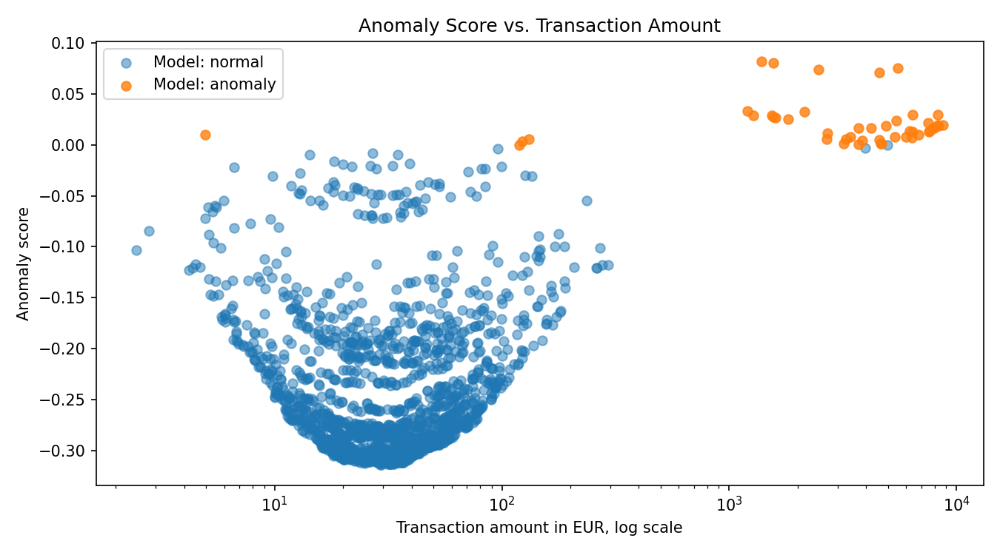

# Banking Transaction Anomaly Detection

This project demonstrates a compact end-to-end data science workflow for detecting unusual patterns in synthetic banking transaction data.

The goal is not to build a production-ready fraud detection system. Instead, the project shows how transaction data can be generated, prepared, modeled, scored and explained in a transparent and reproducible way.

## Use Case

Banks process large volumes of transaction data every day. Data-driven anomaly detection can help identify unusual transaction patterns, such as unusually high amounts, transactions at uncommon hours, foreign country transactions, or activity in unusual merchant categories.

This prototype demonstrates how such patterns can be identified with a simple unsupervised machine learning approach.

## Approach

The project follows a simple data science workflow:

1. Generate synthetic banking transaction data
2. Create transaction-level features
3. Train an unsupervised anomaly detection model
4. Score transactions by anomaly level
5. Add rule-based explanations for flagged transactions
6. Export ranked anomaly results and visualizations

## Model

The project uses an **Isolation Forest** model for unsupervised anomaly detection.

Isolation Forest is suitable for this prototype because it can identify unusual observations without requiring a fully labeled fraud dataset. This makes it useful for exploring anomaly detection scenarios where only limited labeled data is available.

## Features

The model uses the following transaction-level features:

- log-transformed transaction amount
- transaction hour
- night transaction flag
- foreign country flag
- unusual merchant category flag

## Example Output

Each transaction receives an anomaly score. Higher scores indicate more unusual transactions according to the model.

Flagged transactions also receive simple explanations, for example:

- unusually high amount
- transaction at uncommon hour
- foreign country transaction
- unusual merchant category

Example output structure:

| transaction_id | amount_eur | transaction_hour | country | merchant_category | anomaly_score | explanation |
|---|---:|---:|---|---|---:|---|
| TXN_ANOM_00043 | 1382.78 | 23 | BR | cash_withdrawal | 0.0818 | unusually high amount; transaction at uncommon hour; foreign country transaction; unusual merchant category |

## Visualization

The plot below shows the anomaly score versus the transaction amount. Higher anomaly scores indicate more unusual transactions according to the Isolation Forest model.



## Results

The model flags the most unusual transactions and assigns an anomaly score to each transaction.

In one sample run, the model achieved the following performance against the synthetic anomaly labels:

| Class | Precision | Recall | F1-score |
|---|---:|---:|---:|
| Synthetic anomaly | 0.91 | 0.96 | 0.93 |

These metrics are based on intentionally injected synthetic anomalies. They are useful for checking whether the prototype works as expected, but they do not represent real-world fraud detection performance.

## Generated Outputs

The script creates the following files:

- `outputs/transactions_scored.csv`
- `outputs/top_anomalies.csv`
- `outputs/anomaly_amount_distribution.png`
- `outputs/anomaly_amount_distribution_log.png`
- `outputs/anomaly_score_vs_amount.png`

## Project Structure

```text
banking-transaction-anomaly-detection/
├── README.md
├── requirements.txt
├── src/
│   └── main.py
└── outputs/
    ├── transactions_scored.csv
    ├── top_anomalies.csv
    ├── anomaly_amount_distribution.png
    ├── anomaly_amount_distribution_log.png
    └── anomaly_score_vs_amount.png
## Tech Stack

- Python
- pandas
- NumPy
- scikit-learn
- Matplotlib

## How to Run

Create and activate a virtual environment:

```bash
python3 -m venv .venv
source .venv/bin/activate
```

Install dependencies:

```bash
pip install -r requirements.txt
```

Run the project:

```bash
python src/main.py
```

## Relevance

This project reflects core skills relevant for data science in banking:

- exploratory data analysis
- feature engineering
- unsupervised machine learning
- model evaluation
- explainability of model results
- reproducible data workflows
- clear communication of model outputs

## Disclaimer

All data in this project is synthetic. No real customer, banking or transaction data is used.
